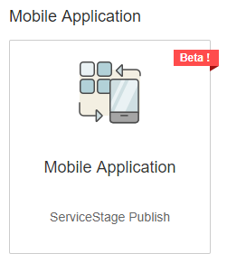
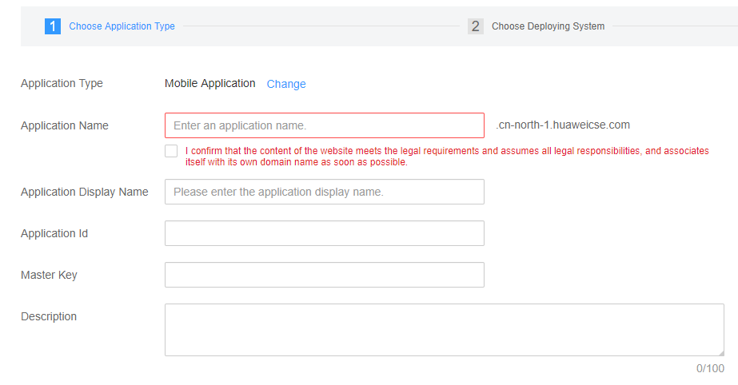
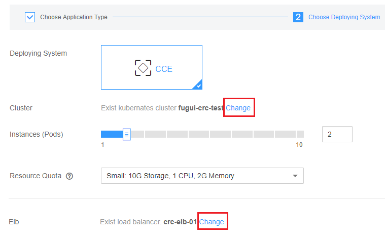
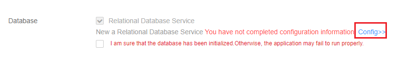

## Step 1:  Create Mobile Backend in Huawei Public Cloud

Follow the steps below to create a Mobile Backend service in the Huawei Public Cloud,

1.  Open a browser and go to Service Stage.  Login using Huawei account if needed. [https://console.huaweicloud.com/servicestage/?region=cn-north-1&locale=en-us&new=true#/apps/selecttype](https://console.huaweicloud.com/servicestage/?region=cn-north-1&locale=en-us&new=true#/apps/selecttype)  

2.  Find the Mobile Application panel, click on it to go to provision page.

3.  Fill in a unique **Application Name**, an **Application Id** and a **Master Key**.  Check the checkbox to confirm if your application meet the legal requirement, Click **Next**.  

4.	Select your **CCE cluster** and **Load Balancer** for deployment.  

5.	Create or select and existing **PostgreSQL 9.5.5** Service.  

6.	Select a valid **Security Group** of the CCE cluster.  

7.	Click **Next** and click **Submit** in the next page to start creating Mobile Backend service.  
