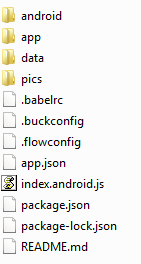
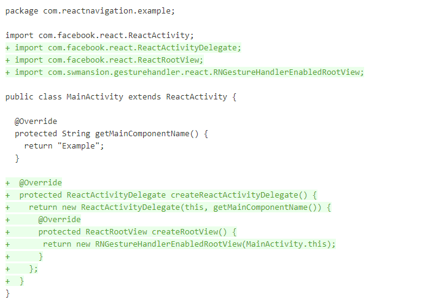
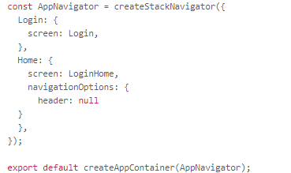
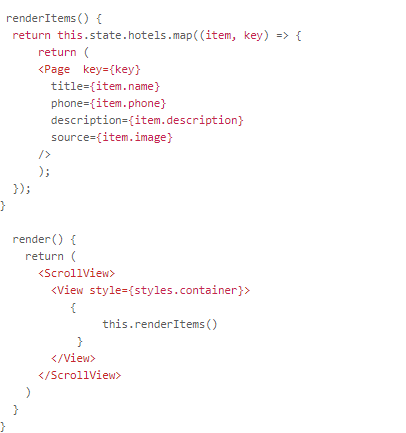
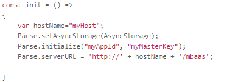
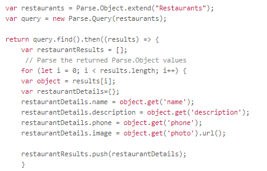

## Step 5:  (Optional) Build Mobile App using React Native

This step explains how to build the Mobile application sample described in this tutorial.  React Native library version 0.57.1 is used for development.  

You have already completed Step 3 and loaded all the source code.  Here are how the files looks like in file system.  

  

Here are some of the key files / folders in the sample,  

*  The manifest file, located at `{{rootdir}}/android/app/src/main/AndroidManifest.xml`, describes essential information about your app like package name, components of the app, which includes all activities, services, broadcast receivers, and content providers,  permissions that the app needs in order to access protected parts of the system or other apps.
*  `{{rootdir}}/app` folder contains the sample app UI source.
*  `{{rootdir}}/index.android.js` file registers the main App component.
*  `{{rootdir}}/app/index.js` file contains 2 pages (Login and Home) using StackNavigator.   StackNavigator is a library for screen navigation in React Native Mobile App.

This React Native Mobile App uses the following npm modules,  

*  `react-navigation` is the StackNavigator module.
*  `react-native-gesture-handler` provides native-driven gesture management APIs.  The code below in MainActivity.java (locate at android\app\src\main\java\com\quickeats) show how to to finalize installation of react-native-gesture-handler for Android,  
  

/app/index.js is where navigation defined.  'createStackNavigator' is a function that returns a React component. It takes a route configuration object as parameter.  It exports from /app/index.js and used as Mobile App’s root component in /index.android.js.  
  

'screen' is a React component for the main content of a screen.  You can override the 'navigationOptions' for a screen as needed.
The Login screen is imported from /app/Login.js. It renders the Login page UI components.  After the user login is successful the user is redirected to the Home screen.  

For more information on navigation, please refer to [https://reactnavigation.org/docs/en/api-reference.html](https://reactnavigation.org/docs/en/api-reference.html).  
  
The app Home page renders menus from /app/pages/Menus/index.js.  

When a menu item is clicked, the corresponding page is rendered from home page.  
 
Restaurants menu item render page from /app/pages/Menus/controller/Restaurants.js  

To use Parse Javascript SDK into the project, we need to install parse SDK npm module.  It is specified in the package.json file.  Parse Javascript SDK is used to connect to Mobile Backend in the sample app.   
The following shows importing the required parse objects and initializing Mobile Backend in /app/data/ParseUtil.js file.  
  
    

The getRestaurants() function in ParseUtil.js is an example of using Parse Javascript SDK apis to query objects from Mobile Backend.  
  

  

  
  
 

