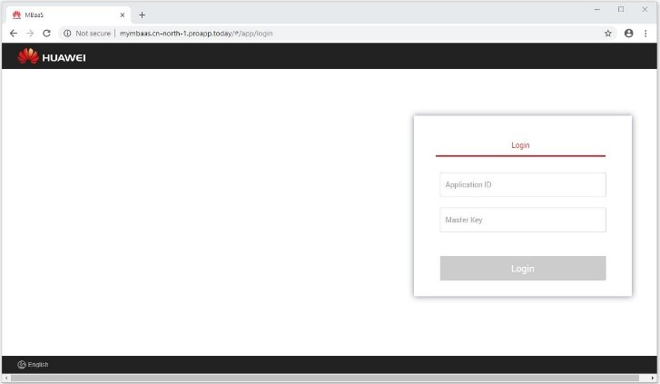
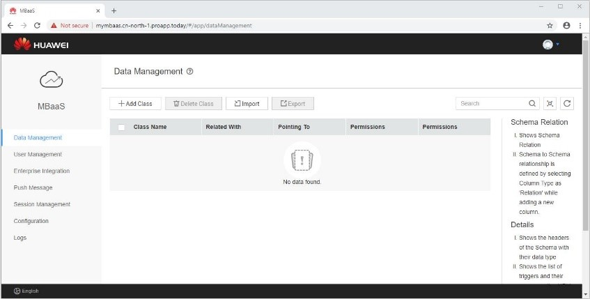
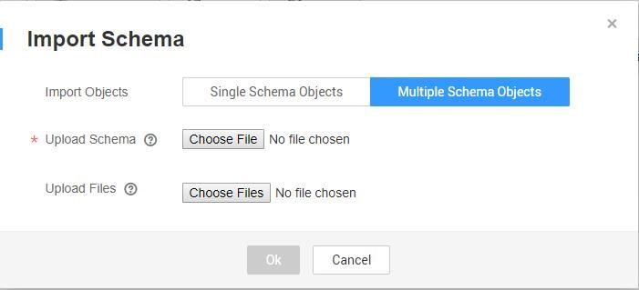
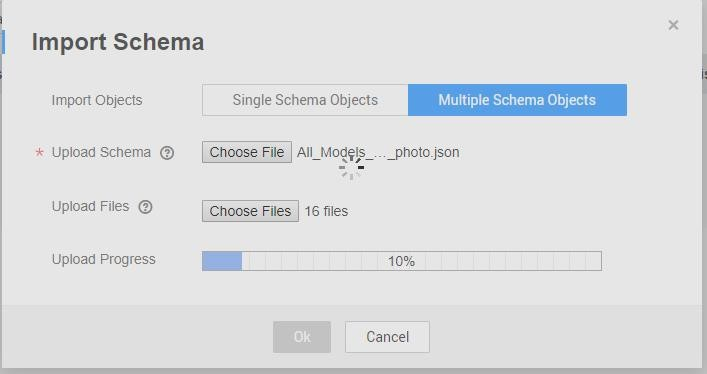

## Step 5:  Import sample data to Mobile Backend 

The Mobile Application described in this tutorial needs sample data.  Use the Huawei Mobile Backend Dashboard to import the data.  

Follow the steps below to import sample data into Mobile Backend:  

1.	In a web browser, launch the Mobile Backend Dashboard.  It was created previously in Step 1 along with the Mobile Backend.  Determine the Application URL of the Mobile Backend in Service Stage Console [https://console.huaweicloud.com/servicestage/?region=cn-north-1#/apps/list](https://console.huaweicloud.com/servicestage/?region=cn-north-1#/apps/list). The url will contain the name you picked during provisioning, for example, http://johnsmbaas.cn-north-1.proapp.today.  
  

2.	To Login to Mobile Backend Dashboard, use the Application ID and Master Key specified in Step 1, during the Mobile Backend provision.  Enter Application ID and Master Key, login to Mobile Backend.  

3.	Upon logging into the Mobile Backend, you are in the Data Management page, where you can import the sample data.  
  

4.	Click Import to open the Import Schema dialog. Choose Multiple Schema Objects  
  

5.	The sample data is in the **servicestage-mobileapp-react-example** github project loaded in Step 3.     

    First, upload the sample schema file located at {{path to}}/servicestage-mobileapp-react-example>/data/All_Models_with_photo.json.  

    Then select the sample photos files folder located at {{path to}}/servicestage-mobileapp-react-example\data\minpics.  

6.	Click Upload to confirm and allow uploading files to the Mobile Backend.  
  

7.	Click OK to start the upload.  

8.	File upload progress will be shown:  
  

9.	Once the import is successful, it will bring you back to Data Management.  You should see the data models and data imported.  Browse around the data and see what was imported.           

